# HSLU.Raytracing
Module raytracing from the ground up

This project demonstrates the progressive development of a raytracing engine, from basic pixel rendering to complex 3D scenes with lighting and shadows.

## Development Stages

### Stage 1: Basic Pixel Rendering
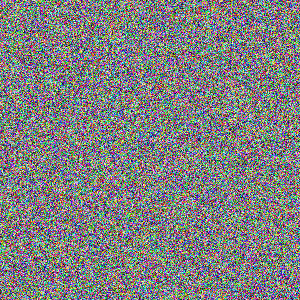

The starting point of the project with randomly colored pixels demonstrating basic screen buffer manipulation.

### Stage 2: Simple Primitive - Single Color
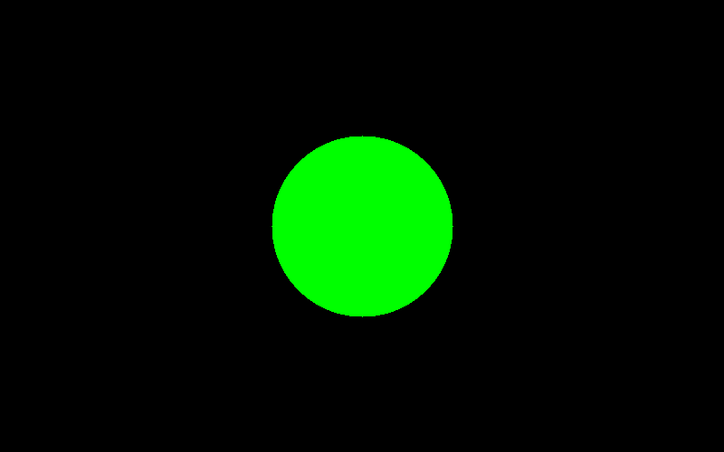

A basic implementation of raytracing with a single green sphere, demonstrating fundamental ray-sphere intersection.

### Stage 3: Solid Primitives with Shading
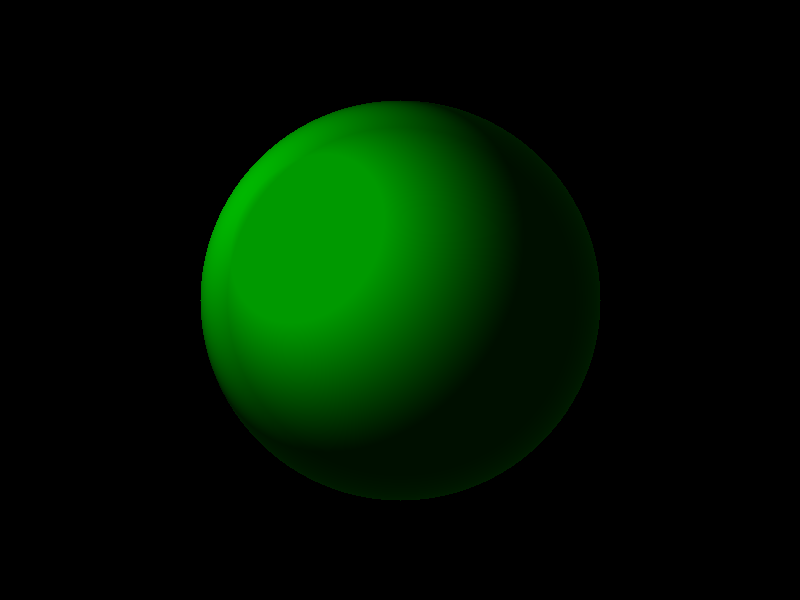

Adding simple shading to create a more three-dimensional appearance for a single sphere.

### Stage 4: Color Compositing
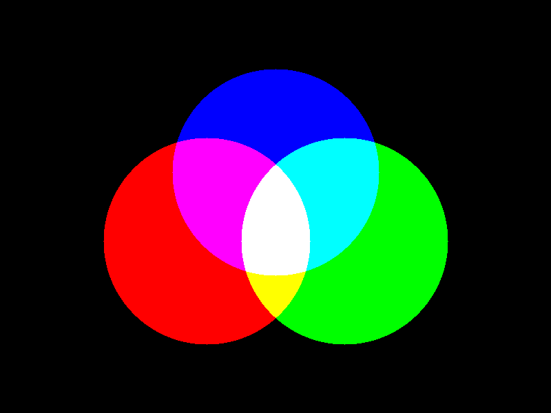

Implementation of color blending and transparency with overlapping shapes to demonstrate the RGB color model.

### Stage 5: Multiple Spherical Objects
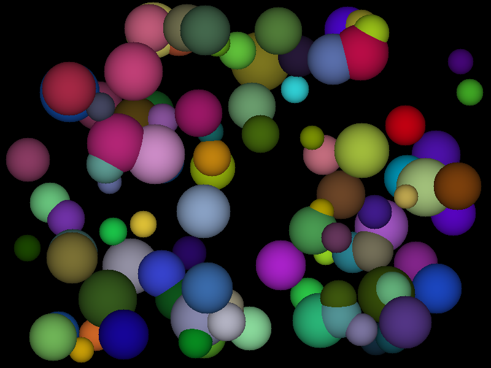

Scaling up to render multiple spherical objects with various colors and sizes.

### Stage 6: Complex Arrangements
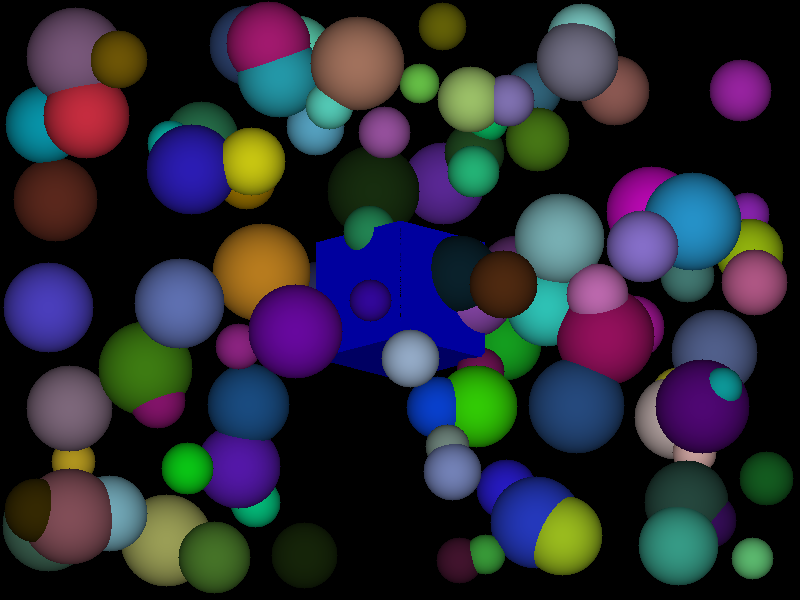

Further complexity with many spheres in a structured arrangement, demonstrating depth and occlusion handling.

### Stage 7: Surface Detail and Material Properties
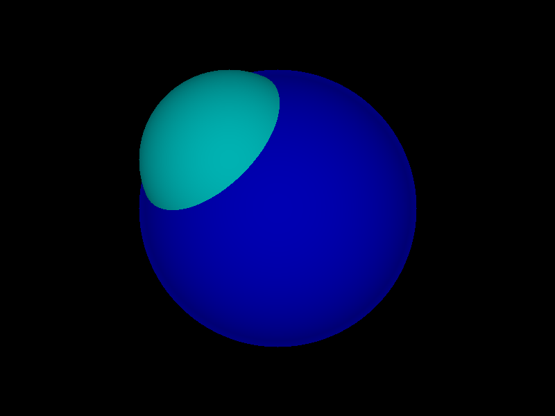

Adding material properties to objects with a blue sphere featuring a teal highlight, showing reflection or material transition.

### Stage 8: Composite Objects
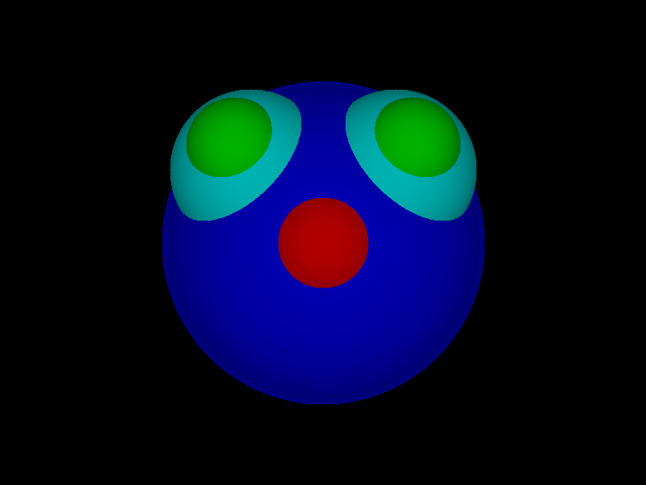

Creating composite objects by arranging primitives to form more complex structures, like this simple face.

### Stage 9: Advanced Scene with Multiple Primitives and Shadows
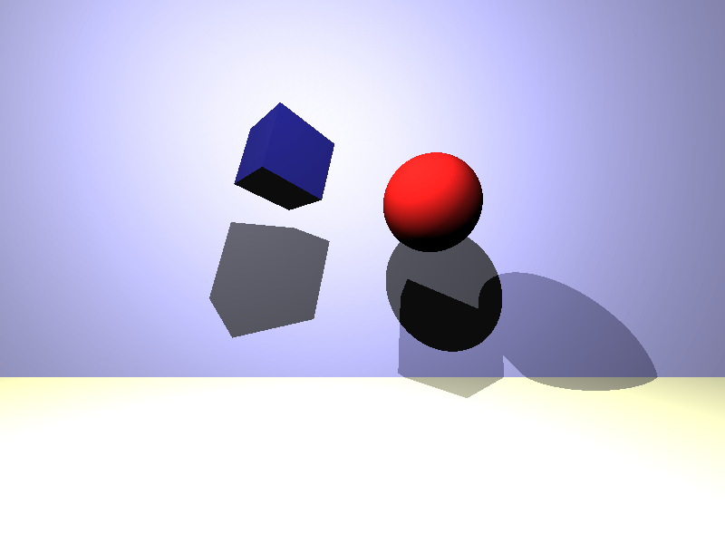

The culmination of the project featuring different primitive types (sphere and cube), with proper shadow casting, demonstrating a complete raytracing implementation.

### Stage 10: Reflection Scene
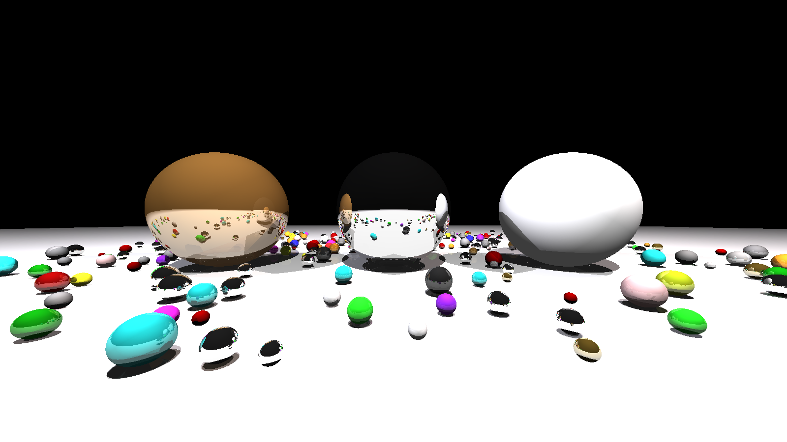

### Stage 11: Colored Environment Interaction
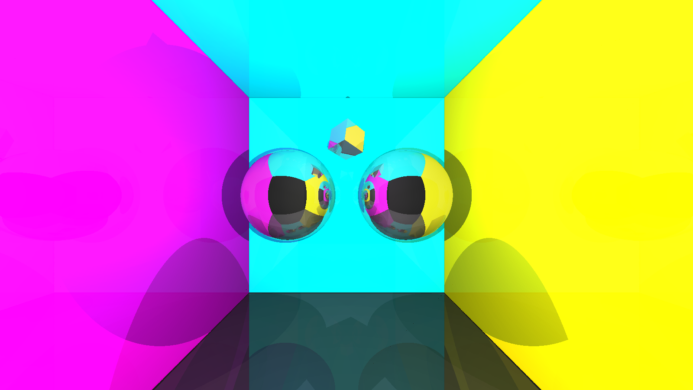

Exploring how objects interact with a colorful environment, with the room's magenta, cyan, and yellow walls creating complex reflection patterns on the spheres.

### Stage 12: Material Property Exploration
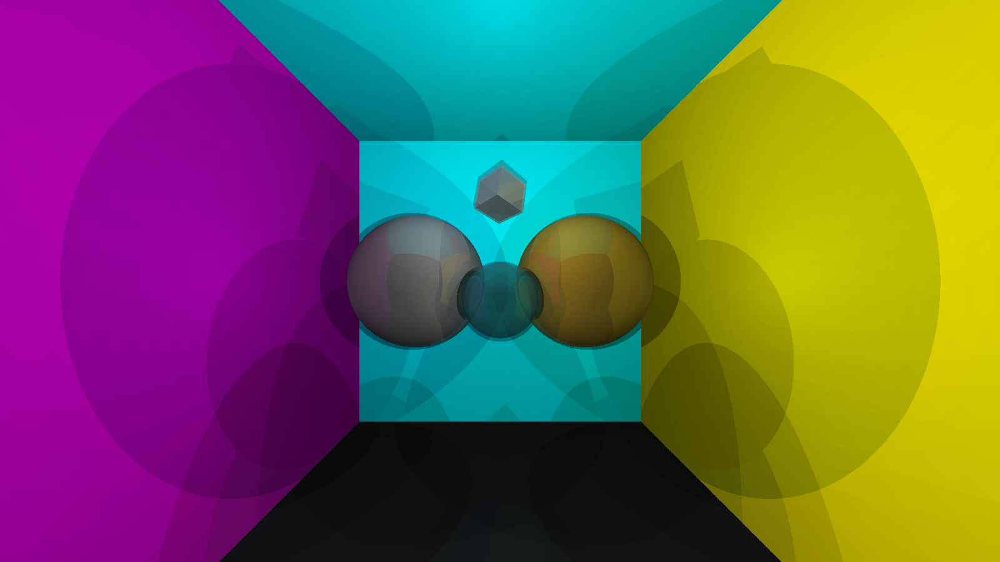

Demonstration of how different solid materials interact with colored lighting, showing subtle differences in reflectivity and surface properties.

### Stage 13: Transparency and Refraction
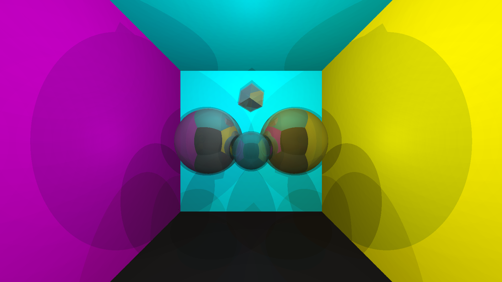

Implementing transparency and refraction to show how light passes through transparent objects, bending and distorting the view of objects behind them.

### Stage 14: Low-Light Environment
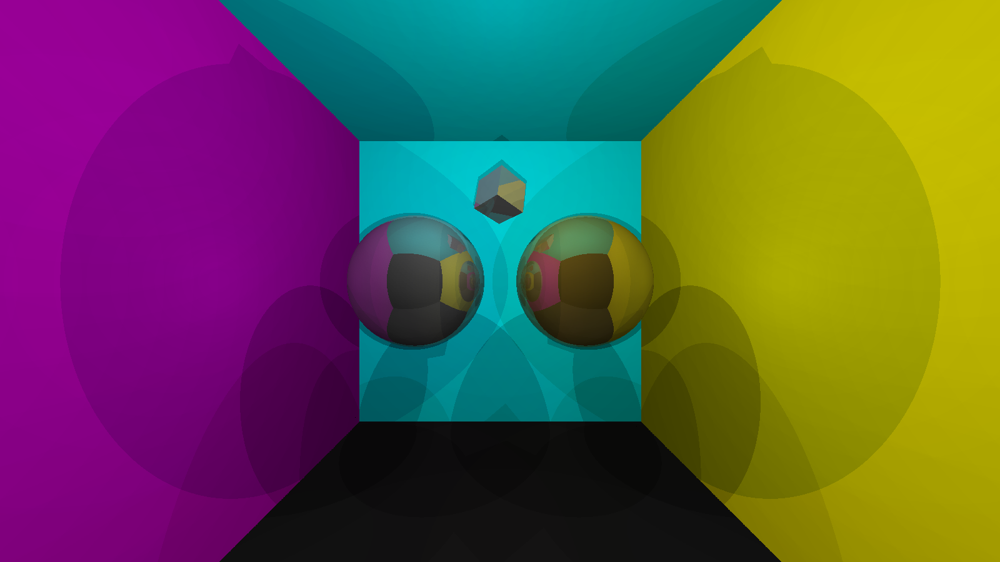

Testing the raytracer's capabilities in low-light conditions, showing how objects still maintain their form and material properties with minimal illumination.

### Stage 15: Minimalist Scene with Focused Materials
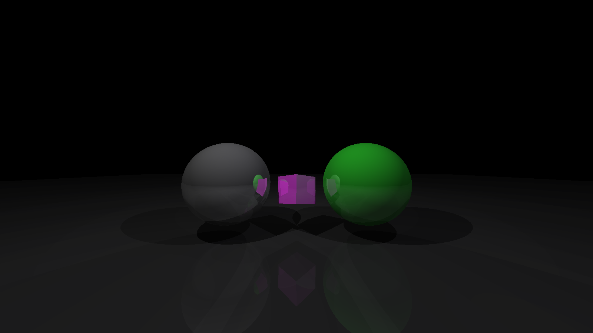

A focused study of material interaction in a minimalist setting with high contrast, showcasing the subtle reflections and shadows on a dark reflective surface.

### Stage 16: Final High-Quality Render
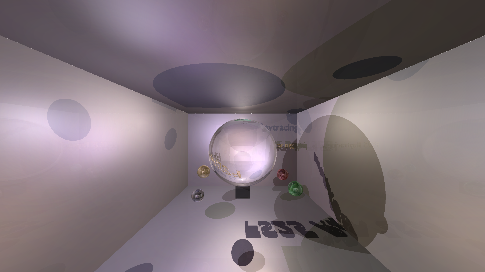

The culmination of all implemented features - a high-quality render displaying a glass sphere with proper refraction, showing text positioned behind it and surrounded by decorative colored spheres.